# MRAC Bench Spec Track v0.1 — Milestone 1 实施计划

## 文档信息

- 状态：已实施并通过验收（2026-09-16）
- 验收记录：[Milestone 1 Implementation Report](./Milestone%201%20Implementation%20Report.md)
- 对应规范：[MRAC Bench Spec Track v0.1 Milestone 1 Spec](./MRAC%20Bench%20Spec%20Track%20v0.1%20Milestone%201%20Spec.md)
- 目标：实现并验收一个真实 case 的 Spec-MRAC 端到端闭环。
- 计划原则：先验证输入与仓库快照，再逐阶段落盘；先用 stub 验证控制流程，最后运行真实 `codex exec`。

## 1. 交付目标

本计划完成时，仓库应能够从单个 case 启动完整流程：

```text
validate case and protocol
→ prepare fixed repository commit
→ generate spec
→ independently audit
→ repair if blocking issues exist
→ re-audit until converged or audit budget is exhausted
→ save complete run record
```

交付包括：

1. 一个可运行的 Python 项目骨架和单 case 开发入口。
2. 一个真实、固定 repository commit 的 Spec case。
3. 一个版本化的 `spec-mrac-v1` protocol 及三个阶段 prompt。
4. 运行器、Codex 执行封装、audit parser、收敛控制和 run 持久化。
5. 关键规则的轻量自动化检查。
6. 至少一次真实 `codex exec` 验收 run，包含可复核的完整 trajectory。

## 2. 实施顺序与阶段门槛

### 阶段 0：确认运行条件并锁定验收 case

**工作项**

- [x] 确认开发环境中的 Python 版本和依赖管理方式。
- [x] 检查 `codex exec` 可用性、版本读取方式、模型配置方式、超时与只读运行选项。
- [x] 从一个公开软件工程任务中选定首个真实 case，固定 repository URL、完整 commit SHA 和静态 task 文本。
- [x] 确认 case 的 task 可在固定 commit 的代码库中理解，不依赖动态网页或不可复现的外部状态。
- [x] 记录验收使用的 model；若无法取得 CLI 版本或 usage 数据，明确记录为 `null`。

**产物**：case 选择记录和运行环境约束，作为 case package 的输入依据。

**完成门槛**：真实仓库可访问，固定 SHA 可 checkout，task 与目标 repository 对应；Codex CLI 能从开发环境启动。任一条件不满足时，先解决该条件，不进入真实集成验收。

### 阶段 1：项目骨架、Case 与 Protocol 输入

**工作项**

- [x] 建立最小 Python 包结构和依赖配置；提供模块运行入口所需的 `__main__`/命令分发。
- [x] 定义 M1 所需的 case/protocol/config 数据对象，不提前实现 plugin registry 或通用扩展系统。
- [x] 实现 case 加载与校验：必需字段、完整 commit SHA、task 路径边界、`track.type=spec`、正数 `max_audit_rounds`。
- [x] 加载 `protocols/spec-mrac-v1/protocol.yaml` 及 `generate.md`、`audit.md`、`repair.md`。
- [x] 新增阶段 prompt，明确输入边界、spec 输出要求和 audit JSON 结构。
- [x] 保存一个可直接运行的真实 case package 到 `cases/<case-id>/`。

**建议目录**

```text
mracbench/
  __init__.py
  __main__.py
  cli.py
  models.py
  cases.py
  protocol.py
  runner.py
  codex_exec.py
  audit.py
  runs.py
protocols/spec-mrac-v1/
  protocol.yaml
  generate.md
  audit.md
  repair.md
cases/<case-id>/
  case.yaml
  task.md
```

**完成门槛**：合法 case/protocol 能加载；非法配置在启动 agent 前失败，并返回清楚的错误类型和消息。

### 阶段 2：Run 初始化、仓库准备与输入快照

**工作项**

- [x] 生成唯一 `run_id`，在独立 `runs/<run-id>/` 建立目录结构。
- [x] 将 case、task、protocol 配置和 prompt 文件复制到 `input/`，保存 effective config 到 `run.yaml`。
- [x] 基于 URL 与完整 SHA 准备 repository checkout；缓存目录与每次 run 输出目录分离。
- [x] 验证 checkout HEAD 与 case 指定 SHA 完全一致。
- [x] 确认 generation 前工作树干净；无法安全确认时以 `REPOSITORY_ERROR` 结束。
- [x] 实现每阶段前后工作树状态检查，检测 tracked/untracked 变更并保留变更清单。
- [x] 将 `.workspaces/`、`runs/` 及其他生成目录纳入 `.gitignore`，避免混入源码提交。

**完成门槛**：错误 URL/SHA、clone/checkout 失败和 HEAD 不匹配都产生明确错误结果；有效仓库被固定到正确快照，run 输入可离线复核。

### 阶段 3：Codex 执行封装与 Generation

**工作项**

- [x] 将命令构造、工作目录、model、timeout、stdout/stderr、退出码和运行时长封装在一个 Codex 执行模块中。
- [x] 所有阶段使用新的 `codex exec` invocation；提示词与本机可用的只读约束均禁止修改 repository source files。
- [x] 保存实际 request、stdout、stderr 和退出状态到对应 `raw/` 子目录。
- [x] 实现 generation：将 task、仓库上下文和 generate prompt 发给 Codex。
- [x] 校验 generation 输出是非空、完整 Markdown 正文；保存为 `artifacts/spec.initial.md`。
- [x] 对 agent 缺失、非零退出、timeout、空输出等情况生成对应终态，并保留已写入产物。

**完成门槛**：可在不修改仓库的情况下完成 generation；raw 输出、request 和初始 spec 均在 run directory 中。

### 阶段 4：Audit、JSON Parser 与收敛状态机

**工作项**

- [x] 定义 audit JSON schema 检查：字段、类型、severity、issue id 唯一性及 `status` 一致性。
- [x] 将每个 audit 作为独立调用，仅输入原始 task、固定仓库、当前 spec 和 audit prompt。
- [x] 保存原始 audit 输出，并将合法结果规范化写入 `audits/audit-NN.json`。
- [x] 对每轮计算 blocking issue 数；non-blocking issue 不影响收敛状态。
- [x] 实现 consecutive-clean 计数：连续两轮无 blocking issue 才收敛；blocking 轮次清零 clean streak。
- [x] 使用 audit invocation 数作为 max round 预算；到达上限后不再 repair，返回 `NON_CONVERGED`。
- [x] 将 agent/解析错误写入结果与 trajectory，且不将其视作 clean 或正常预算耗尽。

**完成门槛**：parser 和收敛状态机可独立测试；clean、blocking、clean→blocking、达到 max rounds 等边界行为符合 Spec。

### 阶段 5：Repair 与闭环编排

**工作项**

- [x] 有 blocking issue 且仍有 audit 预算时，调用 repair，并提供本轮 audit JSON。
- [x] 要求 repair 输出完整 spec，不接受 patch 作为 artifact。
- [x] 按成功 repair 次数保存 `artifacts/spec.round-NN.md`，不覆盖旧版本。
- [x] 当前 audit clean 但 clean streak 仅为 1 时，直接对同一 spec 发起新 audit，不触发 repair。
- [x] 将 generation、audit、repair、收敛检查串为单 case runner；每个阶段完成后立即持久化状态。
- [x] 遇到 `PROTOCOL_VIOLATION` 时停止后续阶段，保存已完成 trajectory 与仓库差异。

**完成门槛**：stub 驱动的单 case run 可复现“issues→repair→clean→clean”并得到 `CONVERGED`；全 clean 初始 spec 能在两轮 audit 后收敛且不产生 repair。

### 阶段 6：Result、错误路径与轻量自动检查

**工作项**

- [x] 实现 `result.json` 必需字段、终态、trajectory、usage 与 error 字段。
- [x] 为每个已启动 audit invocation 写一项 trajectory；失败轮次的 blocking count 为 `null`，且保留错误状态。
- [x] 覆盖 case/protocol 校验、audit JSON parser、收敛逻辑、max rounds、repair artifact 不覆盖、错误不等于 non-convergence 等关键逻辑。
- [x] 使用 stub 或纯函数检查核心规则；真实 Codex 调用不作为常规自动测试依赖。
- [x] 对错误路径确认已完成的 snapshots、raw 输出和 artifacts 仍然存在。

**完成门槛**：关键自动检查通过，`result.json` 与 run directory 内实际产物一致。

### 阶段 7：真实 Codex 集成验收与交付

**工作项**

- [x] 使用阶段 0 固定的真实 case 运行单 case 入口。
- [x] 人工抽查 HEAD、prompt/request、raw stdout/stderr、spec snapshots、audit JSON 和最终 result。
- [x] 确认每轮 audit 不包含之前 audit 内容，且均使用新的 invocation。
- [x] 确认 repository 未修改；若被修改，验证 run 正确终止为 `PROTOCOL_VIOLATION`。
- [x] 记录真实验收 run id、case commit、model、Codex CLI 版本（如可得）、终态与结果目录。
- [x] 更新最小运行说明，给出启动命令和结果目录位置。

**完成门槛**：至少一例真实 case 已走完整闭环，或因明确错误终止；两种情况均有完整可审计结果。`NON_CONVERGED` 是有效验收结果，不要求模型必须收敛。

## 3. 依赖关系

```mermaid
flowchart TD
  A[阶段 0：锁定环境与真实 case] --> B[阶段 1：项目骨架与输入加载]
  B --> C[阶段 2：run 与仓库准备]
  B --> D[阶段 3：Codex 执行与 generation]
  B --> E[阶段 4：audit parser 与收敛状态机]
  C --> F[阶段 5：repair 与闭环编排]
  D --> F
  E --> F
  F --> G[阶段 6：result 与自动检查]
  G --> H[阶段 7：真实集成验收]
```



阶段 3 和阶段 4 的纯模块工作可在阶段 2 完成后并行推进；闭环编排必须等待仓库/run 管理、agent 调用和收敛逻辑都可用。

## 4. 关键决策与约束

- **Case 选择**：本计划不预选具体上游 benchmark case；阶段 0 负责确定真实任务并固定仓库 SHA。选定后将其作为 M1 的唯一验收 case。
- **收敛**：严格按两次连续 clean audit；repair 只在 blocking issue 存在且仍有 audit 预算时运行。
- **错误处理**：agent、timeout、repository、协议违规或解析失败均为错误终态，不得转换为 `NON_CONVERGED`。
- **输入独立性**：每轮 audit 只接触当前轮允许的输入，不给出旧 audit 结果；请求全文进入对应 raw 目录。
- **历史保留**：任何新 spec 都落为新 snapshot；run 失败不删除已完成的 artifact 或日志。
- **实现尺度**：采用满足 M1 的最小 Python 模块边界。完整 AgentAdapter 通用性与 FakeAgent runner 矩阵留到 Milestone 2；suite 留到 Milestone 3，发布安装体验留到 Milestone 4。
- **真实验收**：只运行一个真实 case；为了测试闭环分支可另用 stub，不额外消耗真实模型调用。

## 5. 风险与应对

| 风险 | 影响 | 计划中的应对 |
|---|---|---|
| Codex audit 未返回合法 JSON | 无法安全判定 clean 或 blocking | 作为 `PARSE_ERROR` 终止；保留完整输出和 request，不猜测或自动转 clean |
| Codex CLI 版本或参数差异 | 执行失败或 sandbox 行为不一致 | 阶段 0 验证本机安装版本及官方支持的调用参数；集中封装命令构造 |
| 缓存仓库已有未提交改动 | 结果不可复现或污染 case | generation 前要求工作树干净；记录基线，阶段后比对 tracked/untracked 变更 |
| 固定仓库或 SHA 无法访问 | 无法进入 agent 阶段 | 在 case 准备阶段终止为 `REPOSITORY_ERROR`，不记作 MRAC 未收敛 |
| 单次真实运行耗时或用量较大 | 验收成本上升 | 先用 stub 验证所有分支；真实验收只跑一个 case，使用配置 timeout 和合理的 audit 上限 |
| 首次 case 选择过于依赖大范围代码上下文 | audit 质量或运行稳定性下降 | 阶段 0 检查 task/repository 对应性，优先选择有固定任务描述和明确代码上下文的真实 issue |

## 6. 最终验收清单

- [x] 单 case 开发入口从 case id 启动完整流程。
- [x] 固定 repository commit 校验通过。
- [x] generation、独立 audit、必要时 repair 和再次 audit 已贯通。
- [x] 两次连续 clean 与 max audit rounds 行为通过检查。
- [x] 所有调用 request、stdout/stderr、artifact、audit、配置快照和结果均持久化。
- [x] 错误状态与 `NON_CONVERGED` 明确区分。
- [x] 轻量自动检查通过。
- [x] 至少一次真实 Codex case run 可供人工复核。

## 7. 后续里程碑事项

- Milestone 2：稳定化 AgentAdapter、Case/Protocol/Result contract、FakeAgent runner 测试矩阵与 CLI。
- Milestone 3：suite、多 case 顺序执行、repeat runs 和汇总指标。
- Milestone 4：发布打包、protocol 版本锁定、resume、crash recovery 和完整可复现性支持。
- 其他 agent 实现沿用扩展边界，在后续版本按需要加入。
